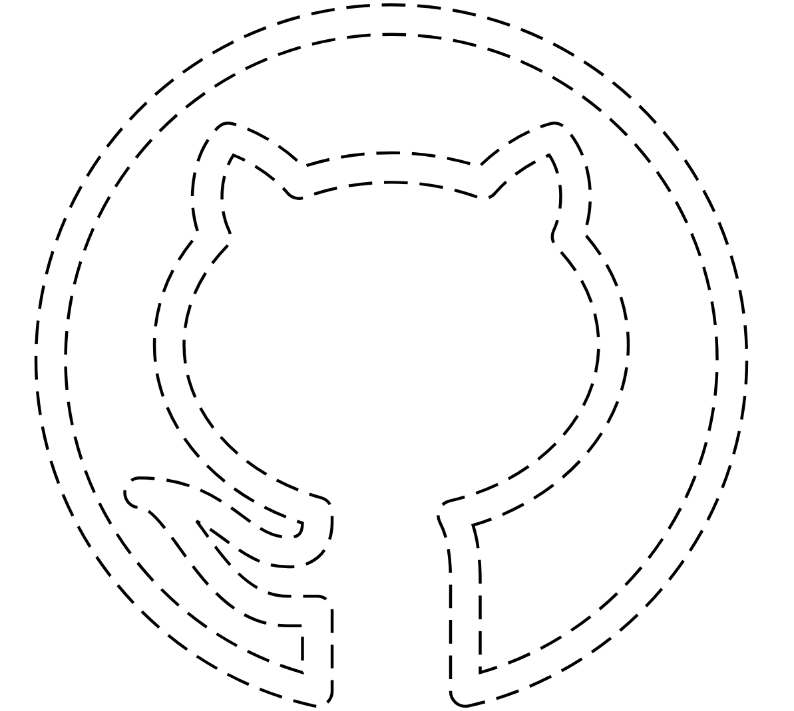
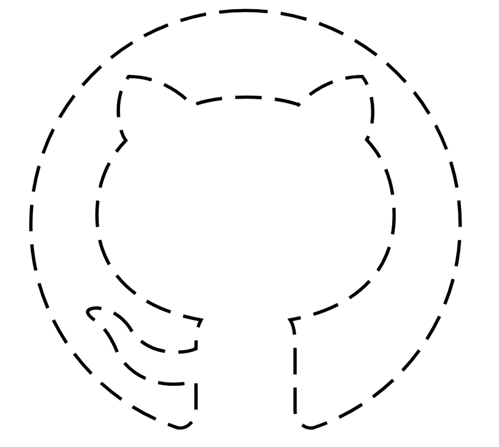

# Sketcher
A demo where a Dash or Cue with SketchKit can do a reasonable job of physically drawing vector-based SVG image files.

## Usage
* From the command-line you can run :  
  `python misc/sketcher.py --file path/to/some/file.svg`  
  For example  
  `python misc/sketcher.py --file assets/svg_files/ww_w.svg`
* After connecting, the robot will begin blinking the top button.
* Place the robot in the center of your drawing area.
* Press the top button
* The robot will draw your drawing !

## Options
### Drawing Size
The robot will resize the drawing so that it fits snugly in a bounding-box which is 90cm wide by 60cm high.
  The size of this box can be changed by including a `--box width_cm height_cm` option.  
  For example, to draw the octocat within a 30cm x 30cm region:  
  `python misc/sketcher.py --file assets/svg_files/octocat.svg --box 30 30`  
.. This box is just the bounds of the drawing itself - be sure to leave some padding (about 8cm) for the robot's wheels !
### Connecting to Robots
  By default the program will connect to the nearest robot it sees. But this might be someone else's robot, and it might even be a Dot !  
  
  Here are some useful connection options. These may all be combined as you like.
#### `--connect-eager`  
  Connect ASAP, but at the cost of a less accurate estimate of what robot is closest.  
#### `--connect-type dash cue`  
  Only look for Dash and Cue robots. Dots are ignored.
#### `--connect-name <some robot name> <another robot name>`
  Only look for robots with this name/s.

### Examples
Putting it all together, here's a reasonable command-line:  
`python misc/sketcher.py --connect-eager --connect-type dash cue --box 90 60 --file assets/svg_files/octocat.svg`

## Tips
### Choosing SVG files
The robot can only draw lines, not filled areas. However, very many SVG files use filled areas which are shaped like lines. Picture a swimming-pool in the shape of the letter **T**. From a distance it looks like two simple pen-strokes, but if the robot had to drive along the edge of the swimming pool it's actually **eight** separate edges !  Most of which are parellel to a nearby edge, so the result ends up looking messy.

|   | **What The File Looks Like** | **What the Robot Draws** |
|---|-----------|--------|
| **Difficult** |  |  |
| **Easier** |  |  |

*octocat image from [here](https://visualpharm.com/free-icons/github-595b40b85ba036ed117dc155).

